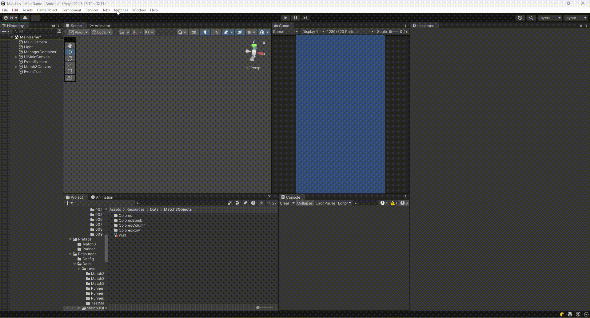

# Project Matches

Welcome to the official repository for Project Matches! This document provides a comprehensive guide to the project's architecture, development workflows, and core mechanics.

## Table of Contents
- [Project Overview](#project-overview)
- [Core Architecture](#core-architecture)
  - [Manager System](#manager-system)
  - [Event System](#event-system)
  - [Level System](#level-system)
  - [UI System](#ui-system)
  - [Save/Load System](#saveload-system)
- [Level Creation Workflow](#level-creation-workflow)
- [Mini-Game Mechanics](#mini-game-mechanics)
  - [Match-3](#match-3)
  - [Runner](#runner)
- [Project Structure](#project-structure)
- [Third-Party Assets](#third-party-assets)
- [Getting Started](#getting-started)
- [Known Issues and Future Improvements](#known-issues-and-future-improvements)

## Project Overview

Project Matches is a versatile Unity-based game framework designed to support various mini-games, starting with a Match-3 and a Runner game. The architecture is highly modular, making it easy to extend and add new features or game modes.

## Core Architecture

The project is built upon a robust and modular architecture to ensure scalability and maintainability.

### Manager System

The core of the framework is the **Manager System**. A central `ManagerContainer` is responsible for initializing and providing access to all other managers. This ensures a clean separation of concerns and a single point of access for core functionalities.

#### Key Managers:

**`EventManager`**: 
- Handles communication between different parts of the game using a publish-subscribe pattern
- Provides decoupled event-driven architecture
- Manages event subscriptions and publications

**`LevelManager`**: 
- Manages the complete lifecycle of levels
- Loads level data from `LevelsContainerSO`
- Handles level progression and state management
- Publishes critical level events

**`UIManager`**: 
- Controls all user interface elements
- Manages panel transitions and UI states
- Responds to game events automatically
- Handles state-driven UI flow

**`SaveLoadManager`**: 
- Manages all game data persistence
- Handles automatic save/load operations
- Stores data in JSON format in persistent data path
- Manages `UserSaveData` serialization

### Event System

The `EventManager` enables decoupled communication between different systems using a publish-subscribe pattern.

#### Subscribing to Events:

To listen for an event, subscribe using the event type:

```csharp
private void OnEnable()
{
    ManagerContainer.Instance.GetManager<EventManager>().Subscribe<LevelLoadedEvent>(OnLevelLoaded);
}

private void OnDisable()
{
    ManagerContainer.Instance.GetManager<EventManager>().Unsubscribe<LevelLoadedEvent>(OnLevelLoaded);
}

private void OnLevelLoaded(LevelLoadedEvent levelEvent)
{
    Debug.Log($"Level {levelEvent.LevelIndex} loaded!");
}
```

#### Publishing Events:

To publish an event, create an instance and pass it to the `Publish` method:

```csharp
var levelEndEvent = new LevelEndedEvent { LevelIndex = currentLevel, Score = playerScore };
ManagerContainer.Instance.GetManager<EventManager>().Publish(levelEndEvent);
```

### Level System

The `LevelManager` orchestrates the entire level flow and is the central hub for level management.

#### Key Features:
- **Level Container Integration**: Loads all level data from `LevelsContainerSO` in Resources folder
- **Index-based Level Loading**: Finds and loads levels by their index in the container
- **Complete Lifecycle Management**: Handles `StartLevel`, `EndLevel`, `LoadNextLevel` operations
- **Progress Integration**: Works with `SaveLoadManager` to track `currentLevelIndex`

#### Published Events:
- `LevelLoadedEvent`: Published after level data is loaded
- `LevelStartedEvent`: Published when gameplay officially begins
- `LevelEndedEvent`: Published on successful level completion
- `LevelFailedEvent`: Published when player fails the level
- `LevelUnloadedEvent`: Published when level resources are unloaded

### UI System

The `UIManager` operates as a state machine, managing different UI panels based on game state.

#### Architecture:
- **Panel Controllers**: Manages `StartPanelController`, `EndPanelController`, `Match3InGamePanelController`, etc.
- **State-Driven Flow**: Uses `UIState` enum to determine active panels
- **Event-Responsive**: Automatically transitions UI based on game events
- **Centralized Control**: Single point of control for all UI elements

#### UI Flow Examples:
- `LevelLoadedEvent` → Show Start Panel
- `LevelStartedEvent` → Show In-Game Panel
- `LevelEndedEvent` → Show Victory Panel
- `LevelFailedEvent` → Show Defeat Panel

### Save/Load System

The `SaveLoadManager` handles all data persistence with automatic save/load capabilities.

#### Features:
- **Automatic Loading**: Loads user data on game start
- **JSON Serialization**: Stores data in readable JSON format
- **Persistent Storage**: Uses `Application.persistentDataPath` for cross-session persistence
- **Data Model**: Uses `UserSaveData` class for structured data storage

## Level Creation Workflow

Levels are created using custom Editor windows that streamline the design process.

### Step-by-Step Process:

1. **Open Level Editor**:
   - For Match-3: `Matches > Match3 Level Creator`
   - For Runner: `Matches > Runner Level Creator`

2. **Design Your Level**:
   - Configure grid layout (Match-3)
   - Set track segments (Runner)
   - Define level-specific properties
   - Set difficulty parameters

3. **Save the Level**:
   - Editor serializes data into `ScriptableObject` asset
   - Asset is saved in `Assets/Data` folder
   - Level becomes a reusable asset

4. **Add to Level Container**:
   - Open `LevelsContainerSO` in Resources folder
   - Add your new level asset to the levels list
   - Level becomes accessible via index
   - `LevelManager` can now load the level

### Important Notes:
- Levels are loaded by index from the container
- Missing levels will cause silent failures (see Known Issues)
- Level data is loaded at runtime via `Resources.Load()`

## Mini-Game Mechanics

The framework supports multiple mini-game types with distinct mechanics.

### Match-3

#### Game Pieces

The Match-3 game features various piece types with special abilities:

| Piece Type | Visual | Description |
|------------|--------|-------------|
| **Default Piece** |  | Standard game piece that can be matched with others of the same type |
| **Bomb Piece** |  | Explodes and destroys surrounding pieces in a radius |
| **Row Destroyer** |  | Destroys all pieces in the same horizontal row |
| **Column Destroyer** |  | Destroys all pieces in the same vertical column |

#### Core Systems:

**Grid System**:
- Grid layout defined in level data
- `GridManager` handles grid state management

**Input Handling**:
- `InputManager` detects player interactions
- Supports swipe gestures
- Translates input into game actions (piece swapping)
- Validates legal moves before execution

**Matching Logic**:
- Scans for horizontal and vertical matches (3+ pieces)
- Removes matched pieces from grid
- Supports cascade matching for chain reactions
- Continues until no new matches are possible

## Project Structure

The `Assets` folder maintains a clean and scalable structure:

- **`/Scripts`**: All C# source code, organized by system
  - `/Core`: Manager classes and core architecture
  - `/MiniGames`: Game-specific logic (Match3, Runner)
  - `/Editor`: Unity Editor extensions and tools
  
- **`/Scenes`**: Unity scenes for different game states
- **`/Prefabs`**: Reusable game objects and UI elements
- **`/UI`**: UI sprites, fonts, and interface assets
- **`/Editor`**: Editor-only scripts and tools
- **`/Resources/Level`**: Contains `LevelsContainerSO` for level management and level datas
- **`/Resources/Match3Objects`**: ScriptableObjects for Match-3 game pieces
- **`/Materials`**: 3D rendering materials and shaders

## Third-Party Assets

- **[Free Casual Buttons Pack](https://assetstore.unity.com/packages/2d/gui/free-casual-buttons-pack-307406)**: Provides polished UI button elements for better visual presentation

## Getting Started

1. **Clone Repository**: Download the project to your local machine
2. **Open in Unity**: Import project via Unity Hub
3. **Main Scene**: Navigate to `Assets/Scenes/MainGame` and open the main game scene
4. **Run Game**: Press Play in Unity Editor to start testing
5. **Create Levels**: Use the custom editor tools to design new levels
6. **Test Gameplay**: Verify your levels work correctly in both game modes

## Level Create Demonstrations

### Match3 Level Creation Process
Watch how to create new levels using the custom editor tools:



*Step-by-step level creation using Match3 Level Creator*

### Runner Level Creation Process
Watch how to create new levels using the custom editor tools:


*Step-by-step level creation using Match3 Level Creator*

## Known Issues and Future Improvements

### Current Limitations:

**Empty Level Container**: 
- No graceful handling when `LevelsContainer` is empty
- Fails silently without error messages
- No automatic fallback or default level generation

**2D to 3D Rendering Issues**:
- Project initially configured for 2D pipeline
- Runner game (3D) has lighting artifacts
- Material rendering not optimized for 3D content
- Requires render pipeline adjustment

**Testing Infrastructure**:
- No unit test coverage
- Architecture is modular but Unity-coupled
- Some components difficult to test in isolation
- Would benefit from dependency injection for testability

**Animation System**:
- Currently uses Coroutines for animations
- Could be improved with **DoTween** package
- Would provide better performance and cleaner code
- More maintainable animation sequences
